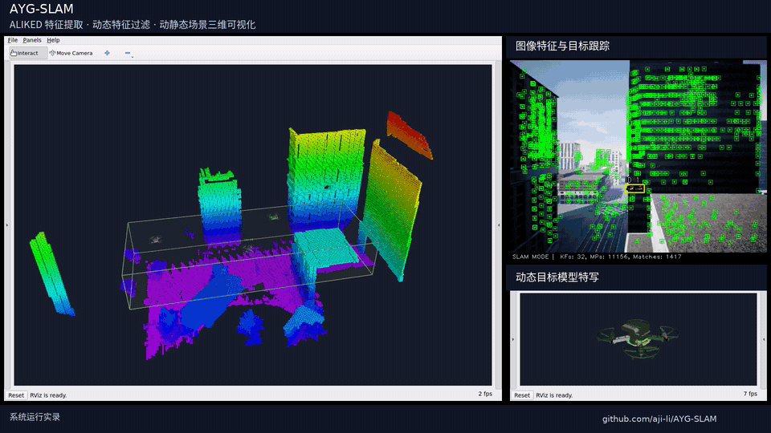
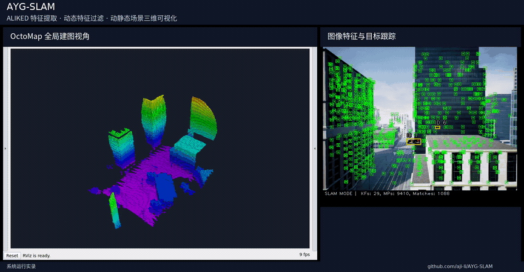
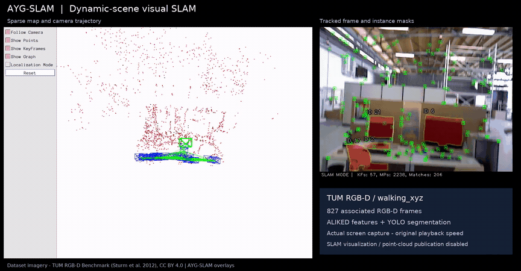

# AYG-SLAM：基于学习型特征和动态特征剔除的SLAM系统

<p align="center">
  <strong>简体中文</strong> | <a href="README_EN.md">English</a>
</p>

## 运行演示

### AirSim 序列 3：第三人称跟随建图

[](media/airsim-sequence3-octomap.mp4)

[观看 / 下载 AirSim 建图视频](media/airsim-sequence3-octomap.mp4)

### AirSim 序列 3：全局建图视角

[](media/airsim-sequence3-global.mp4)

[观看 / 下载全局视角视频](media/airsim-sequence3-global.mp4)

### TUM walking_xyz：特征跟踪

[](media/tum-walking-xyz.mp4)

[观看 / 下载运行视频](media/tum-walking-xyz.mp4) · [独立评估工具示例](docs/EVALUATION_DEMO.md)

AYG-SLAM 基于 ORB-SLAM2，前端采用 ALIKED 特征，结合动态目标检测与跟踪，以及几何一致性检查，实现动态场景下的相机轨迹估计与静态环境建图。项目支持 RGB-D 和双目输入，集成 ROS 2 点云发布、OctoMap 建图与 RViz2 可视化。

仓库提供 TUM RGB-D、AirSim RGB-D 录制数据、KITTI 双目和 EuRoC 双目的运行示例。

<p align="center">
  <a href="#主要功能">主要功能</a> ·
  <a href="#环境依赖">环境依赖</a> ·
  <a href="#编译">编译</a> ·
  <a href="#运行">运行</a> ·
  <a href="#配置与模型">配置与模型</a> ·
  <a href="#相关文档">相关文档</a> ·
  <a href="#致谢">致谢</a>
</p>

## 主要功能

- **学习型特征前端：** 将 ALIKED 关键点与描述子集成到 ORB-SLAM2 的跟踪和局部建图流程。
- **回环检测与重定位：** 支持地点识别、回环检测与跟踪丢失后的重定位。
- **动态特征过滤：** 结合 YOLO 检测或分割结果，以及对极几何和深度一致性检查，过滤动态特征。
- **多目标跟踪：** 使用 motcpp 跟踪后端关联连续帧中的检测结果，支持配置 `person`、`uav` 等动态类别。
- **静态环境建图：** 将过滤后的局部点云以 ROS 2 `sensor_msgs/PointCloud2` 消息发布，用于 OctoMap 建图。
- **可视化：** 提供 Pangolin SLAM 查看器，并通过 RViz2 展示点云、占据地图、TF、动态目标三维包围框和无人机网格模型。

### 代码导读

| 模块 | 主要内容 |
| --- | --- |
| [ALIKEDextractor](src/ALIKEDextractor.cc) | 模型加载、推理设备选择与运行封装 |
| [System](src/System.cc) | 图像输入接口、线程回收与轨迹导出 |
| [Frame](src/Frame.cc)、[KeyFrame](src/KeyFrame.cc)、[MapPoint](src/MapPoint.cc) | 帧位姿、关键帧共视关系与地图点观测管理 |
| [YoloDetector](src/YoloDetector.cc)、[YoloSegDetector](src/YoloSegDetector.cc) | 检测与分割推理接口、跟踪结果关联 |
| [PointCloudMapping](src/PointCloudMapping.cc) | 关键帧队列、坐标变换、ROS 点云与标记发布 |
| [FrameDrawer](src/FrameDrawer.cc)、[MapDrawer](src/MapDrawer.cc)、[Viewer](src/Viewer.cc) | 图像叠加、地图绘制与交互显示 |

## 环境依赖

当前构建脚本面向 **Ubuntu 22.04 和 ROS 2 Humble**。

| 组件 | 要求 / 当前配置 |
| --- | --- |
| 编译器 | GCC / G++ 11；脚本默认使用 `gcc-11` 和 `g++-11` |
| 构建工具 | CMake 3.26 及以上；默认使用 Ninja |
| 计算机视觉库 | OpenCV 4.x、Eigen 3、Pangolin |
| C++ 依赖库 | yaml-cpp、Boost，以及仓库内的 DBoW2 和 g2o |
| ALIKED 推理 | LibTorch 和 CUDA Toolkit 12.1 及以上 |
| YOLO 推理 | ONNX Runtime GPU 1.18.0 |
| ROS 集成 | ROS 2 Humble 和 `ament_cmake` |
| 建图与可视化 | PCL、OctoMap、ROS 2 `octomap_server`、RViz2 |
| Python 工具 | Python 3.10；依赖见 [env/requirements.txt](env/requirements.txt) |

构建时需要在本地准备以下依赖目录：

```text
Thirdparty/libtorch/
Thirdparty/Pangolin/install/
Thirdparty/YOLOs-CPP/onnxruntime-linux-x64-gpu-1.18.0/
```

请在编译前准备好这些依赖库和模型权重；仅克隆源码可能不包含体积较大的二进制依赖。LibTorch 和 ONNX Runtime 的版本需与本机 CUDA 环境兼容。

[scripts/setup_humble.sh](scripts/setup_humble.sh) 用于配置本地库路径，默认 CUDA 路径为 `/usr/local/cuda-12.1`。如果依赖安装位置不同，请相应调整该脚本。当前 motcpp 构建设置为 `MOTCPP_ENABLE_ONNX=OFF`，未启用其基于 ONNX 的 ReID 后端。

## 编译

安装依赖后，在仓库根目录执行：

```bash
source scripts/setup_humble.sh
```

根项目使用 `ament_cmake`，因此以下两种构建方式都需要 ROS 2 Humble 环境。构建脚本会自动编译 DBoW2 和 g2o，并解压 `Vocabulary/ORBvoc.txt.tar.gz`。

### RGB-D SLAM

```bash
./build.sh
```

默认构建目录为 `build_native/`，生成 `Examples/RGB-D/rgbd_tum`。

### 启用 OctoMap 的 RGB-D SLAM

```bash
./build_octomap.sh
```

默认构建目录为 `build_humble/`，生成 `Examples/RGB-D/rgbd_tum_octomap`。

如需双目 OctoMap 示例，在同一构建目录中继续编译：

```bash
cmake --build build_humble --parallel 4 \
  --target stereo_kitti_octomap stereo_euroc_octomap
```

脚本支持通过 `BUILD_DIR`、`JOBS`、`CMAKE_BIN` 和 `ORB_SLAM2_OPENCV_DIR` 覆盖默认设置。例如，使用系统 CMake 并限制并行编译任务数：

```bash
CMAKE_BIN="$(command -v cmake)" JOBS=4 ./build_octomap.sh
```

两种构建模式应依次执行，因为它们共用第三方构建目录，以及 `lib/libORB_SLAM2.so` 等源码目录下的输出文件。

如需通过 ROS 2 工作空间编译并使用安装后的 launch 文件，请参阅 [ROS 2 包使用说明](docs/ROS2_PACKAGE.md)。

## 运行

以下示例均在仓库根目录执行。请将 `/path/to/...` 替换为实际数据集路径；封装脚本中的默认路径与开发机器相关，建议显式传入参数。

### 准备 RGB-D 数据

TUM 和 AirSim RGB-D 程序接收四个参数：词典文件、相机配置文件、序列目录和 RGB / 深度图像关联文件。关联文件的每行格式为：

```text
rgb_timestamp rgb/image.png depth_timestamp depth/image.png
```

图像路径相对于序列目录。运行前，请在对应 YAML 中设置相机标定参数、深度缩放系数、模型路径和动态类别。

### TUM RGB-D

使用普通构建版本估计轨迹：

```bash
source scripts/setup_humble.sh
./Examples/RGB-D/rgbd_tum \
  Vocabulary/ORBvoc.txt \
  Examples/RGB-D/TUM3.yaml \
  /path/to/tum_sequence \
  /path/to/associations.txt
```

完成 OctoMap 版本编译后，可启动完整建图流程：

```bash
./scripts/run_octomap_tum.sh \
  Vocabulary/ORBvoc.txt \
  Examples/RGB-D/TUM3.yaml \
  /path/to/tum_sequence \
  /path/to/associations.txt
```

### AirSim RGB-D

```bash
./scripts/run_octomap_airsim.sh \
  Vocabulary/ORBvoc.txt \
  Examples/RGB-D/airsim_new.yaml \
  /path/to/airsim_sequence \
  /path/to/associations.txt
```

AirSim 录制数据需要采用上述 RGB-D 关联格式，并使用与录制数据一致的相机和深度配置。

### KITTI 双目

序列目录需要包含 `image_0/`、`image_1/` 和 `times.txt`。请根据序列的相机标定选择对应 YAML。

```bash
./scripts/run_octomap_kitti.sh \
  Vocabulary/ORBvoc.txt \
  Examples/Stereo/KITTI00-02.yaml \
  /path/to/kitti/sequences/00
```

### EuRoC 双目

```bash
./scripts/run_octomap_euroc.sh \
  Vocabulary/ORBvoc.txt \
  Examples/Stereo/EuRoC.yaml \
  /path/to/MH_01_easy/mav0/cam0/data \
  /path/to/MH_01_easy/mav0/cam1/data \
  Examples/Stereo/EuRoC_TimeStamps/MH01.txt
```

### ROS 2 建图流程与输出

OctoMap 封装脚本会加载 Humble 环境、启动 `octomap_server`、按配置启动 RViz2，并运行 SLAM 程序。建图数据流如下：

```text
RGB-D / 双目图像 → AYG-SLAM → /AYG/Local_Point_Clouds
                                      ↓
                                octomap_server
                                      ↓
                               /octomap_binary → RViz2
```

在封装脚本命令前设置 `START_RVIZ=0` 可关闭 RViz2。该选项仅控制 RViz2；如需关闭 SLAM 查看器，请单独配置。

RGB-D 程序会在工作目录中输出 `CameraTrajectory.txt` 和 `KeyFrameTrajectory.txt`。安装后的 ROS 2 launch 文件默认使用 `~/.ros/ayg_slam` 作为输出目录。生成的轨迹和地图属于运行产物。

## 配置与模型

| 运行场景 | 配置文件 | 配置中使用的 YOLO 模型 |
| --- | --- | --- |
| TUM RGB-D | [TUM3.yaml](Examples/RGB-D/TUM3.yaml) | `models/yolo26n-seg.onnx` |
| AirSim RGB-D | [airsim_new.yaml](Examples/RGB-D/airsim_new.yaml) | `models/yolo26n_uav.onnx` |
| KITTI 双目 | [KITTI00-02.yaml](Examples/Stereo/KITTI00-02.yaml)、[KITTI03.yaml](Examples/Stereo/KITTI03.yaml)、[KITTI04-12.yaml](Examples/Stereo/KITTI04-12.yaml) | 请检查所选 YAML |
| EuRoC 双目 | [EuRoC.yaml](Examples/Stereo/EuRoC.yaml) | 请检查所选 YAML |

ALIKED 从 `models/<model-name>.pt` 加载权重，当前 RGB-D 配置选择 `aliked-n32`。运行前请确认对应的 ALIKED 权重、YOLO ONNX 模型和类别标签文件已准备好。自定义模型权重需要与标签文件和检测器配置匹配。

仓库提供 [TUM](Examples/RGB-D/octomap_view_tum.rviz) 和 [AirSim](Examples/RGB-D/octomap_view_airsim.rviz) 的 RViz2 预设。

[Examples/pt_to_onnx.py](Examples/pt_to_onnx.py) 提供 YOLO 模型导出工具，可通过以下命令安装其可选 Python 依赖：

```bash
python3 -m pip install -r env/requirements.txt
```

这些 Python 包不包含 C++、CUDA 和 ROS 依赖。

## 仓库结构

```text
AYG-SLAM/
├── src/                 # SLAM、ALIKED、YOLO/MOT 与建图实现
├── include/             # C++ 头文件
├── Examples/            # 数据集示例程序、相机配置与 RViz 预设
├── launch/              # ROS 2 启动文件
├── scripts/             # 构建、环境配置、运行与评估辅助脚本
├── Thirdparty/          # 第三方源码与本地运行依赖
├── Vocabulary/          # ORB 词袋模型词典
├── models/              # 本地 ALIKED、YOLO 权重与标签文件
├── 3dmod/               # 无人机可视化网格模型
├── env/                 # 依赖清单
└── docs/                # 环境搭建、参数配置与集成说明
```

## 相关文档

- [ROS 2 包编译与启动](docs/ROS2_PACKAGE.md)
- [原始 ORB-SLAM2 README](https://github.com/raulmur/ORB_SLAM2)

## 致谢

感谢以下开源项目的作者和维护者。AYG-SLAM 基于这些项目的实现与研究成果进行开发：

| 项目 | 在 AYG-SLAM 中的用途 |
| --- | --- |
| [ORB-SLAM2](https://github.com/raulmur/ORB_SLAM2) | 基础 SLAM 架构、跟踪、局部建图、回环检测与重定位。 |
| [ALIKED](https://github.com/Shiaoming/ALIKED) | 学习型关键点检测与局部描述子提取。 |
| [YOLOs-CPP](https://github.com/Geekgineer/YOLOs-CPP) | C++ YOLO 目标检测与分割推理。 |
| [motcpp](https://github.com/Geekgineer/motcpp) | 与 YOLO 检测结果配合使用的多目标跟踪后端。 |
| [octomap_server / octomap_mapping](https://github.com/OctoMap/octomap_mapping) | ROS 点云集成与 OctoMap 占据地图构建。 |
| [Pangolin](https://github.com/stevenlovegrove/Pangolin) | 交互式 SLAM 可视化。 |
| [g2o](https://github.com/RainerKuemmerle/g2o) | 图优化与光束法平差（Bundle Adjustment）。 |
| [DBoW2](https://github.com/dorian3d/DBoW2) | 基于词袋模型的地点识别，用于回环检测与重定位。 |

仓库内的 DBoW2 和 g2o 版本来自 ORB-SLAM2 发行版本。在科研工作中使用本项目时，请查阅上游仓库的相关论文与引用说明。

## 许可证

本仓库现有 GPLv3 许可证声明见 [LICENSE.txt](LICENSE.txt) 和 [License-gpl.txt](License-gpl.txt)。第三方组件保留各自的许可证，具体内容请查阅对应源码目录中的许可证文件。
