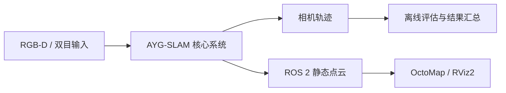

# AYG-SLAM · 项目与代码展示

**简体中文** | [English](README_EN.md)

**面向动态场景的视觉 SLAM：ALIKED 特征、YOLO 目标感知与几何约束。**

AYG-SLAM 基于 ORB-SLAM2，探索动态场景下的 RGB-D / 双目定位与静态环境建图，集成 ROS 2 点云发布、OctoMap 和 RViz2。

本仓库面向技术交流与面试展示，公开选定的工程代码和独立评估示例。核心算法仍在研究中，完整实现暂未公开；这里不是完整 SLAM 系统的可复现发布版本。

[系统概览](#系统概览) · [代码导读](#代码导读) · [运行评估示例](#运行评估示例) · [致谢](#致谢)

## 系统概览

完整项目采用 ALIKED 关键点与描述子作为前端特征，保留 ORB / DBoW2 地点识别用于回环与重定位，结合 YOLO 检测或分割、多目标跟踪及几何一致性检查处理动态目标。



工程集成涉及 C++、CUDA / LibTorch、ONNX Runtime、OpenCV 和 ROS 2 Humble。以下公开片段展示数据输入检查、运行时编排、轨迹输出和评估组织方式，不包含尚未发表的算法细节。

## 代码导读

| 文件 | 可查看的内容 | 运行范围 |
| --- | --- | --- |
| [RGB-D 程序入口](examples/rgbd_tum_octomap.cc) | 图像关联读取、尺寸检查、帧处理计时、轨迹输出、ROS 生命周期 | 代码阅读；依赖未公开核心 |
| [ROS 2 启动编排](examples/ros2/ayg_slam.launch.py) | 参数声明、输入路径检查、进程启动、OctoMap 与 RViz2 配置 | 代码阅读；依赖完整系统安装 |
| [多次运行评估汇总](tools/summarize_evo_multirun.py) | 读取 evo 结果、统计轨迹覆盖率、筛选运行、输出 CSV 与 Markdown | 可独立运行 |
| [演示数据生成器](demo/create_demo_results.py) | 构造可复现的最小评估输入 | 可独立运行；仅为合成数据 |

公开代码从完整项目中复制并做了必要的展示适配，具体来源见 [NOTICE.md](NOTICE.md)。RGB-D 入口基于 ORB-SLAM2 示例扩展；本仓库不将上游工作表述为独立原创。

## 运行评估示例

需要 Python 3，仅使用标准库。在仓库根目录运行：

```bash
python3 demo/create_demo_results.py demo-output
python3 tools/summarize_evo_multirun.py \
  demo-output/runs demo-output/summary \
  --expected-poses demo-output/expected_poses.json
```

输出包括 `demo-output/summary/all_runs.csv`、`README.md`，以及选中的 `best_ate/` 和 `best_rpe/` 运行副本。再次运行时请使用新的输出目录。

筛选规则是先取有效轨迹点数最多的运行，再分别选择 ATE 和 RPE RMSE 最小者。演示中 `run_1` 应被选为最佳 ATE，`run_2` 应被选为最佳 RPE；误差更低但轨迹不完整的 `run_3` 不应被选中。

**演示轨迹和误差均为合成数据，只用于检查工具行为，不代表 AYG-SLAM 的实际精度。** 该脚本汇总现有指标，不执行轨迹对齐或计算 ATE / RPE。

使用自己的评估数据时，按以下结构准备输入，并在 JSON 中填写每个序列的预期轨迹点数：

```text
runs/<sequence>/run_1/
├── CameraTrajectory.txt
├── ape.zip                 # 包含 stats.json，至少含 rmse 字段
├── rpe.zip                 # 同上
└── rpe_point_distance.zip  # 可选，同上
```

同组运行需使用一致的对齐方式、米制平移误差和 RPE 设置。覆盖率分母应与实际输入序列相匹配。

## 公开范围

本仓库仅包含上表中的代码及展示文档。核心算法、模型权重、数据集、调参配置和实验记录暂未公开。详情见 [公开范围说明](docs/PUBLIC_SCOPE.md)。

完整研发仓库与本展示仓库使用独立 Git 历史。此处没有完整系统的构建入口，也不包含可替代核心源码的二进制文件。

## 致谢

完整 AYG-SLAM 项目基于以下开源工作，感谢其作者与维护者：

| 项目 | 用途 |
| --- | --- |
| [ORB-SLAM2](https://github.com/raulmur/ORB_SLAM2) | 基础 SLAM 架构及 RGB-D 示例 |
| [ALIKED](https://github.com/Shiaoming/ALIKED) | 学习型局部特征 |
| [YOLOs-CPP](https://github.com/Geekgineer/YOLOs-CPP) | C++ 检测与分割推理 |
| [motcpp](https://github.com/Geekgineer/motcpp) | 多目标跟踪 |
| [octomap_server / octomap_mapping](https://github.com/OctoMap/octomap_mapping) | 点云与占据地图集成 |
| [Pangolin](https://github.com/stevenlovegrove/Pangolin) | SLAM 可视化 |
| [g2o](https://github.com/RainerKuemmerle/g2o) | 图优化 |
| [DBoW2](https://github.com/dorian3d/DBoW2) | 词袋地点识别 |

## 许可证与来源

公开代码的许可证和来源说明见 [NOTICE.md](NOTICE.md) 与 [GPLv3 许可证](License-gpl.txt)。上游版权声明予以保留。
