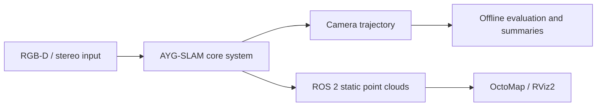

# AYG-SLAM · Project and Code Showcase

[简体中文](README.md) | **English**

**Visual SLAM for dynamic scenes with ALIKED features, YOLO perception, and geometric constraints.**

AYG-SLAM extends ORB-SLAM2 to explore RGB-D / stereo localization and static environment mapping in dynamic scenes, integrating ROS 2 point-cloud publication, OctoMap, and RViz2.

This repository shares selected engineering code and an independent evaluation example for technical discussion and interviews. Core algorithms remain under research and the full implementation is not public. This is not a reproducible release of the complete SLAM system.

[System Overview](#system-overview) · [Code Guide](#code-guide) · [Run the Evaluation Example](#run-the-evaluation-example) · [Acknowledgements](#acknowledgements)

## System Overview

The full project uses ALIKED keypoints and descriptors in the frontend, retains ORB / DBoW2 place recognition for loop closure and relocalization, and combines YOLO detection or segmentation, multi-object tracking, and geometric consistency checks to handle dynamic objects.



Integration involves C++, CUDA / LibTorch, ONNX Runtime, OpenCV, and ROS 2 Humble. The public excerpts demonstrate input validation, runtime orchestration, trajectory output, and evaluation organization. Unpublished algorithm details are omitted.

## Code Guide

| File | What to inspect | Execution scope |
| --- | --- | --- |
| [RGB-D entry point](examples/rgbd_tum_octomap.cc) | Image association loading, size checks, frame timing, trajectory output, ROS lifecycle | Source review; requires omitted core |
| [ROS 2 orchestration](examples/ros2/ayg_slam.launch.py) | Launch arguments, path validation, process startup, OctoMap and RViz2 configuration | Source review; requires full system installation |
| [Multi-run evaluation summary](tools/summarize_evo_multirun.py) | evo archive loading, trajectory coverage, run selection, CSV and Markdown output | Independently runnable |
| [Demo fixture generator](demo/create_demo_results.py) | Reproducible minimal evaluation input | Independently runnable; synthetic data only |

The excerpts were copied from the full project and adapted for this showcase; see [NOTICE.md](NOTICE.md) for provenance. The RGB-D entry point extends the ORB-SLAM2 example. Upstream work is not presented as original work by this project.

## Run the Evaluation Example

Python 3 is required; only the standard library is used. Run from the repository root:

```bash
python3 demo/create_demo_results.py demo-output
python3 tools/summarize_evo_multirun.py \
  demo-output/runs demo-output/summary \
  --expected-poses demo-output/expected_poses.json
```

Outputs include `demo-output/summary/all_runs.csv`, `README.md`, and copies of the selected `best_ate/` and `best_rpe/` runs. Use a new output directory when repeating the example.

Selection first maximizes the number of valid trajectory poses, then independently minimizes ATE and RPE RMSE. The example should select `run_1` for best ATE and `run_2` for best RPE. The incomplete `run_3` should not win despite its lower error.

**All demo trajectories and errors are synthetic fixtures for checking tool behavior, not measured AYG-SLAM accuracy.** The script summarizes existing metrics; it does not align trajectories or calculate ATE / RPE.

For your own evaluation data, use this layout and supply a JSON object mapping each sequence name to its expected pose count:

```text
runs/<sequence>/run_1/
├── CameraTrajectory.txt
├── ape.zip                 # Contains stats.json with at least an rmse field
├── rpe.zip                 # Same archive structure
└── rpe_point_distance.zip  # Optional, same archive structure
```

Use consistent alignment, translational errors in meters, and RPE settings across compared runs. Expected pose counts must match the input sequences.

## Public Scope

Only the code listed above and showcase documentation are included. Core algorithms, model weights, datasets, tuned configurations, and experiment records are withheld. See [Public Scope](docs/PUBLIC_SCOPE.md).

The development and showcase repositories have independent Git histories. This repository provides neither a full-system build entry point nor binaries that substitute for the omitted core source.

## Acknowledgements

The full AYG-SLAM project builds on the following open-source work. We thank their authors and maintainers:

| Project | Role |
| --- | --- |
| [ORB-SLAM2](https://github.com/raulmur/ORB_SLAM2) | Base SLAM architecture and RGB-D example |
| [ALIKED](https://github.com/Shiaoming/ALIKED) | Learned local features |
| [YOLOs-CPP](https://github.com/Geekgineer/YOLOs-CPP) | C++ detection and segmentation inference |
| [motcpp](https://github.com/Geekgineer/motcpp) | Multi-object tracking |
| [octomap_server / octomap_mapping](https://github.com/OctoMap/octomap_mapping) | Point-cloud and occupancy mapping integration |
| [Pangolin](https://github.com/stevenlovegrove/Pangolin) | SLAM visualization |
| [g2o](https://github.com/RainerKuemmerle/g2o) | Graph optimization |
| [DBoW2](https://github.com/dorian3d/DBoW2) | Bag-of-words place recognition |

## License and Provenance

See [NOTICE.md](NOTICE.md) and the [GPLv3 license](License-gpl.txt) for the selected code's license and provenance. Upstream copyright notices are retained.
